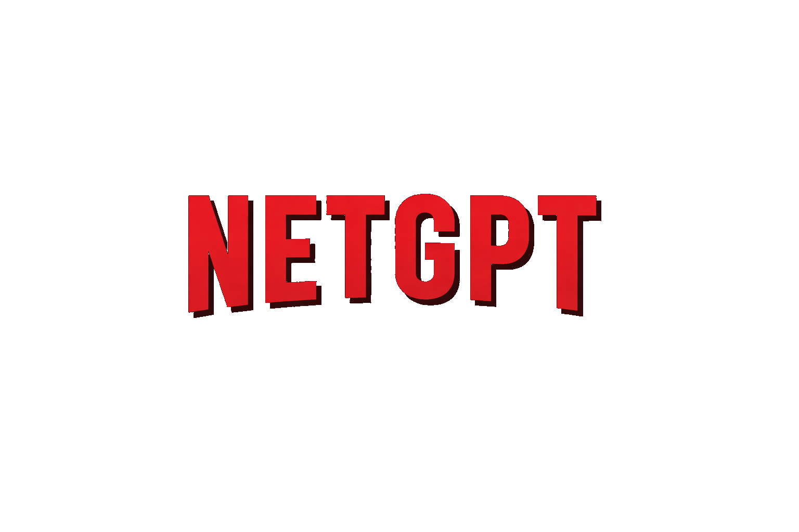

# NetGPT - AI-Powered Movie Explorer

NetGPT is a modern, responsive Netflix-style web application that integrates AI to enhance your movie discovery experience. Powered by GPT-3.5, it provides intelligent movie recommendations and a seamless user interface.



## 🔗 Live Demo
[Explore NetGPT Live](https://majestic-mandazi-e4c457.netlify.app/)

## 🚀 Features

- **AI-Powered Search:** Get movie recommendations based on natural language queries using OpenAI's GPT.
- **Dynamic Hero Section:** Automatically plays trailers for trending movies with a sleek overlay.
- **Comprehensive Movie Lists:** Browse movies by categories like "Now Playing," "Popular," "Top Rated," and "Upcoming."
- **Interactive Modals:** View detailed movie information, including plot, cast, ratings, and AI-suggested related picks.
- **Multi-Language Support:** Full support for multiple languages (English, Hindi, Spanish, etc.).
- **Responsive Design:** Fully optimized for mobile, tablet, and desktop devices with touch-friendly navigation.
- **Secure Authentication:** User login and signup powered by Firebase Authentication.
- **State Management:** Robust application state handling using Redux Toolkit.

## 🛠️ Tech Stack

- **Frontend:** React.js, Tailwind CSS
- **State Management:** Redux Toolkit
- **Routing:** React Router DOM
- **Backend/BaaS:** Firebase (Auth & Hosting)
- **AI Integration:** OpenAI API
- **Movie Data:** OMDB API
- **Animations:** Framer Motion

## 🏁 Getting Started

### Prerequisites

- Node.js (v18 or higher)
- npm or yarn
- Firebase Project
- OpenAI API Key
- OMDB API Key

### Installation

1. **Fork the Repository:** Click the 'Fork' button at the top right of this page to create your own copy.
2. **Clone the Project:**
   ```bash
   git clone https://github.com/YOUR_USERNAME/netflixgpt.git
   cd netflixgpt
   ```
3. **Install Dependencies:**
   ```bash
   npm install
   ```
4. **Environment Configuration:**
   Create a `.env` file in the root directory and add your API keys:
   ```env
   VITE_OPENAI_KEY=your_openai_api_key
   VITE_YOUTUBE_API_KEY=your_youtube_api_key
   ```
   *Note: Ensure your OMDB API key is updated in `src/utils/constants.js` if it's not already using environment variables.*

5. **Start the Development Server:**
   ```bash
   npm run dev
   ```

## 🍴 How to Fork and Customize

1. **Fork:** Click the fork button on GitHub.
2. **Personalize UI:** Modify `tailwind.config.cjs` to change colors or themes.
3. **Add Features:** Explore `src/components` to add new sections or enhance existing ones.
4. **Deploy:** 
   - **Firebase:** Run `npm run build` and then `firebase deploy`.
   - **Netlify/Vercel:** Connect your forked repository for automatic CI/CD.

## 🤝 Contributing

Contributions are welcome! If you have suggestions for improvements or new features, feel free to open an issue or submit a pull request.

1. Fork the Project
2. Create your Feature Branch (`git checkout -b feature/AmazingFeature`)
3. Commit your Changes (`git commit -m 'Add some AmazingFeature'`)
4. Push to the Branch (`git push origin feature/AmazingFeature`)
5. Open a Pull Request

## 📄 License

This project is licensed under the MIT License - see the [LICENSE](LICENSE) file for details.

---
Built with ❤️ by [Ayush](https://github.com/ayush)